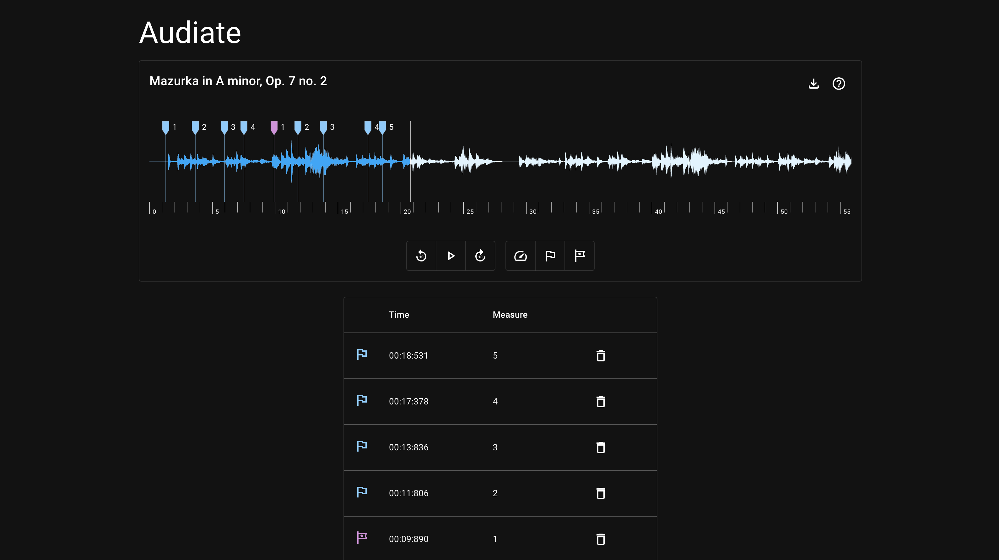

# Audiate

Annotate audio files with measures.


### Screenshot
<p float="left" align="middle">
    
</p>

## Getting Started

```bash
npm install
npm run dev
```

Open [http://localhost:3000/audiate](http://localhost:3000/audiate) with your browser to see the result.
